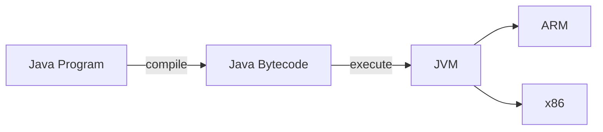
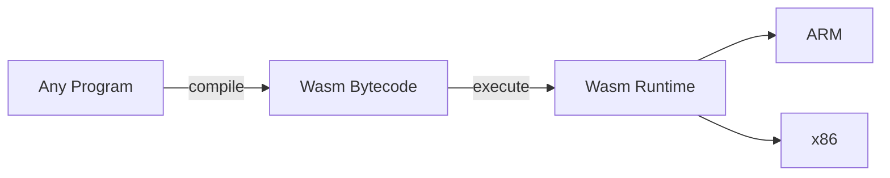
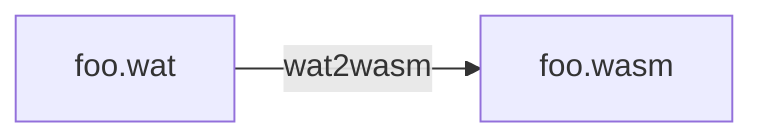

$whoami
---

<!-- no_footer -->

```yaml +no_background
Name:   Gaurav Gahlot
Role:   Staff Software Engineer @IONOS Cloud
X:      @_gauravgahlot
GitHub: gauravgahlot
Web:    https://gauravgahlot.in/
OSS:
  - Akri (maintainer, CNCF Sandbox)
  - kube-dra (slow WIP)
  - Tinkerbell
  ...
```

<!-- end_slide -->

<!-- no_footer -->

WebAssembly · What?
---

📌 It's **neither**:

```text +no_background
   ❌  Web         — runs on servers, edge, IoT
   ❌  Assembly    — a virtual ISA, not a physical one
```

<!-- end_slide -->

<!-- no_footer -->

WebAssembly · Overview
---

📌 You already know this shape — it's the **JVM**:

<!-- new_line -->



<!-- end_slide -->

<!-- no_footer -->

WebAssembly · Overview
---

📌 Wasm is the same idea — any language, **sandboxed** by default:

<!-- new_line -->



<!-- end_slide -->

<!-- no_footer -->

WebAssembly · Overview
---

📌 Just another _bytecode_ format — with four properties:

<!-- new_line -->

| Property        | Description                             |
| --------------- | --------------------------------------- |
| **Security**    | Sandboxed execution environment         |
| **Performance** | Near-native — _with a JIT/AOT engine_   |
| **Polyglot**    | Supports a wide set of source languages |
| **Portability** | Cross-platform and cross-architecture   |

<!-- end_slide -->

<!-- no_footer -->

Wasm Module · Text Form (WAT)
---

📌 The text format (`foo.wat`):

```sh
(module
  (func (export "run") (param i32 i32) (result i32)
    local.get 0
    local.get 1
    i32.add))
```



<!-- end_slide -->

<!-- no_footer -->

Wasm Module · Binary Form (bytes)
---

📌 The same program as bytes (`foo.wasm`):

```sh
0061 736d 0100 0000 0107 0160 027f 7f01  .asm.......`....
7f03 0201 0007 0701 0372 756e 0000 0a09  .........run....
0107 0020 0020 016a 0b                   ... . .j.
```

<!-- end_slide -->

<!-- no_footer -->

Wasm Module · The Sections
---

📌 Typed sections — all optional, all length-prefixed:

```sh
00  custom    -  names / debug info (ignored at run time)
01  type      ✓  function signatures
02  import    ✓  what the module needs from the host
03  function  ✓  which type each function has
04  table     -  funcrefs, for call_indirect
05  memory    -  linear memory declaration
06  global    -  global variables
07  export    ✓  what the module exposes (e.g. "run")
08  start     -  a function run at instantiation
09  element   -  table initializers
0a  code      ✓  the function bodies (instructions)
0b  data      -  memory initializers
```

<!-- end_slide -->

<!-- no_footer -->

Runtime · The Four Stages
---

📌 One module, four stages — bytes become a result.

```sh
decode:      bytes -> structs
validate:    type-check the module
instantiate: memory, imports, start
execute:     interpret (or JIT)
```

📌 **Every** runtime does these four — Wasmtime, WasmEdge, the browser ... and Whisk.

<!-- end_slide -->

<!-- no_footer -->

Runtime · Meet Whisk
---

📌 Minimal by design.

```sh
Whisk:
  lines:   ~745 (dependency-free Rust)
  decodes: 5 of 12 sections
  opcodes: 8
  values:  i32
  safety:  no unsafe
```

<!-- end_slide -->

<!-- no_footer -->

Runtime · Stage 1 · Decode
---

📌 Split the flat bytes into length-prefixed **sections** (`id · length · payload`):

```sh {1|2|3|4|5}
00 61 73 6d 01 00 00 00            preamble · \0asm, version 1
01 07  01 60 02 7f 7f 01 7f        TYPE     · (i32, i32) -> i32
03 02  01 00                       FUNCTION · func 0 : type 0
07 07  01 03 72 75 6e 00 00        EXPORT   · "run" -> func 0
0a 09  01 07 00 20 00 20 01 6a 0b  CODE     · the function body
```

<!-- end_slide -->

<!-- no_footer -->

Runtime · Stage 2 · Validate
---

📌 **Any runtime:** Type-check the whole module.

```text +no_background
   → validate once, run fearlessly
   → well-typed instructions, balanced stack, in-range indices
   → the executor never re-checks; untrusted code runs safe and fast
```

<!-- end_slide -->

<!-- no_footer -->

Runtime · Stage 2 · Validate
---

📌 **Whisk:** 8 bytes and a leap of faith:

```rust
// 4-byte magic number. The string `\0asm`.
const MAGIC_NUMBER: &[u8] = &[0x00, 0x61, 0x73, 0x6D];

// The WebAssembly binary format version.
const WASM_BIN_FMT_VERSION: &[u8] = &[0x1, 0x00, 0x00, 0x00];
```

```rust
fn validate(bytes: &[u8]) -> bool {

    &bytes[0..4] == MAGIC_NUMBER &&
    &bytes[4..8] == WASM_BIN_FMT_VERSION

}
```

<!-- end_slide -->

<!-- no_footer -->

Runtime · Stage 3 · Instantiate & Memory
---

📌 **Any runtime:**

```text +no_background
   → allocate memory / tables / globals
   → resolve host imports, run the start function (live instance)
   → linear memory — strings, arrays, buffers — live there
```

<!-- end_slide -->

<!-- no_footer -->

Runtime · Stage 3 · Instantiate & Memory
---

📌 **Whisk:** declares the shape, then stops — no bytes behind it:

```rust
pub(crate) struct Memory {
    pub min: u32,         // Minimum pages (64KB each)
    pub max: Option<u32>, // Optional maximum pages
}
```

📌 No memory ⇒ scalars only ⇒ **non-WASI** (no host files / net / clock).

<!-- end_slide -->

<!-- no_footer -->

Runtime · Stage 4 · Execute
---

📌 **Any runtime:** walk the instructions on a stack machine.

📌 `run(5, 3)`:

```text {1|2|3|4}
local.get 0     push arg0              ->  stack: [5]
local.get 1     push arg1              ->  stack: [5, 3]
i32.add         pop 3, pop 5, push 8   ->  stack: [8]
end             return top of stack    ->  8
```

<!-- end_slide -->

<!-- no_footer -->

Runtime · Stage 4 · Execute
---

📌 **Whisk:** A tiny interpreter.

```text +no_background
   → 8 opcodes
   → one 'match' over a program counter
   → walks a straight line only
```

<!-- end_slide -->

<!-- no_footer -->

The Interpreter · an `enum` + a `match`
---

📌 The whole executor is an **enum** (the ISA) + a **match** (dispatch):

```rust
// OpCode defines the supported WebAssembly instructions
enum OpCode {
    I32Const(i32),  // 0x41
    LocalGet(u32),  // 0x20
    LocalSet(u32),  // 0x21
    I32Add,         // 0x6a
    I32Mul,         // 0x6c
    Call(u32),      // 0x10
    Return,         // 0x0f
    End,            // 0x0b
}
```

<!-- end_slide -->

<!-- no_footer -->

The Interpreter · an `enum` + a `match`
---

```rust
match op {
    OpCode::I32Const(v) => stack.push(v),
    OpCode::LocalGet(i) => stack.push(locals[i]),
    OpCode::I32Add => {
        let x = stack.pop();
        let y = stack.pop();
        stack.push(x + y);
    }

    // ...one arm per opcode
}
```

📌 Add an `OpCode`; the compiler guides you.

📌 Simple — but slow per op. _So how do the fast engines run it?_

<!-- end_slide -->

<!-- no_footer -->

Making it Fast
---

📌 Same bytecode, three strategies:

```sh
interpret:      instant start, tiny, portable
baseline JIT:   quick native code, good speed
optimizing JIT: slow compile, fastest code
```

<!-- end_slide -->

<!-- no_footer -->

Demo · One run(), Three Languages
---

📌 The same `run(a, b)` — each compiled to Wasm, and run by **Whisk**:

<!-- column_layout: [1, 1, 1] -->

<!-- column: 0 -->

**WAT**

```wat
(func (export "run")
  (param i32 i32)
  (result i32)
  local.get 0
  local.get 1
  i32.add)
```

<!-- column: 1 -->

**Rust**

```rust
#[no_mangle]
pub extern "C" fn run(
  a: i32, b: i32,
) -> i32 {
  a + b
}
```

<!-- column: 2 -->

**Go**

```go
//export run
func run(
  a, b int32,
) int32 {
  return a + b
}
```

<!-- reset_layout -->

```sh
$ whisk add.wasm --invoke run --args 2 3
```

<!-- end_slide -->

<!-- no_footer -->

Is it Safe? · The Sandbox
---

📌 A module can't do I/O itself — needs WASI.

📌 A module runs **untrusted**, yet can't harm the host:

```yaml
memory: touches only its own linear memory — never host RAM
control: structured control flow — no jumps to arbitrary code
access: capability-based, deny-by-default — no files / net / clock
```

📌 This is _why_ Wasm shows up in plugins, edge, and multi-tenant clouds.

<!-- end_slide -->

<!-- no_footer -->

Where this fits?
---

📌 Lightweight engines are everywhere in 2026:

```yaml
- containerd + runwasi # run Wasm as a workload under Kubernetes
- Spin / SpinKube # fast-cold-start serverless functions
- wasmCloud # distributed apps from Wasm components
- Component Model + WASI 0.2 # typed interfaces — modules compose by shared types
```

📌 Container cold start: hundreds of ms + an OS image.
Wasm: ~1 ms cold start, modules typically tens of KB

📌 Containers for services, Wasm for functions & plugins.

<!-- end_slide -->

<!-- no_footer -->

Takeaways
---

📌 WebAssembly is a stack machine in a binary envelope.

📌 A runtime is 4 stages: decode → validate → instantiate → execute.

📌 Small engines are exactly how Wasm shows up in cloud native.

📌 You could build a thin slice of all four **this weekend**.

<!-- end_slide -->

<!-- no_footer -->

Thank you! 🙇🏻
---

Slides:

- [Web](https://gauravgahlot.in/talks)
- [GitHub](https://github.com/gauravgahlot/talks)

References:

- [WebAssembly](https://webassembly.org/)
- [Whisk](https://github.com/gauravgahlot/whisk)
